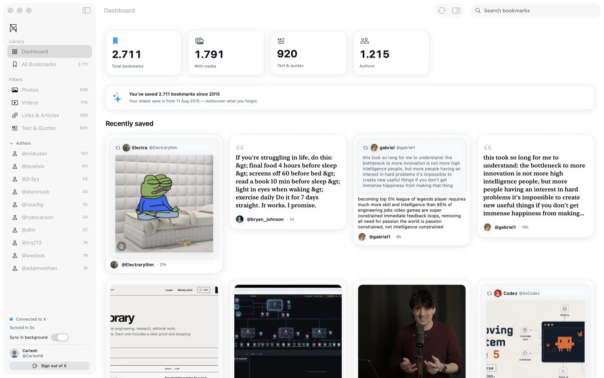
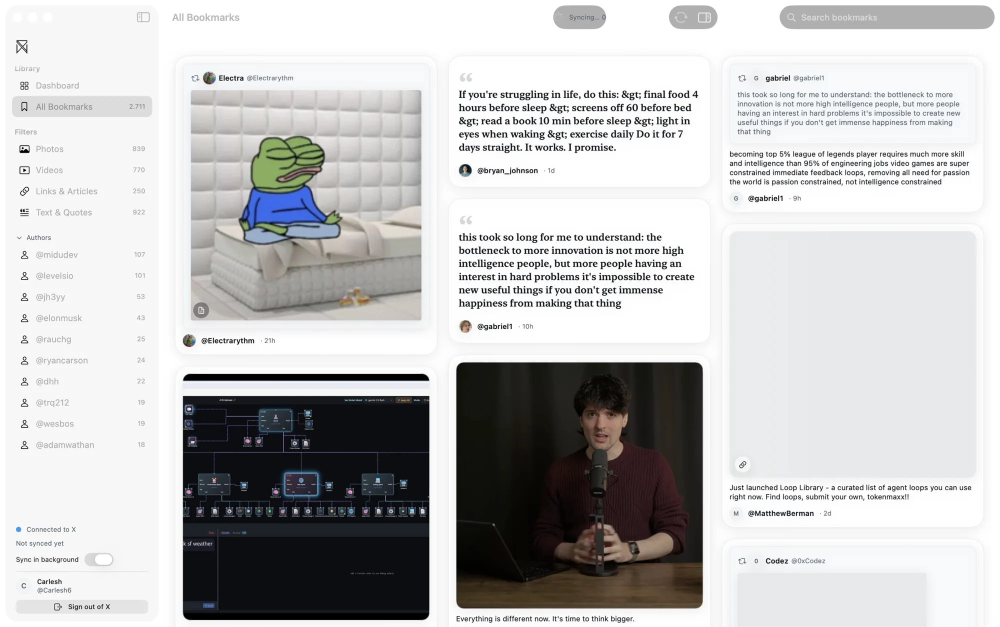
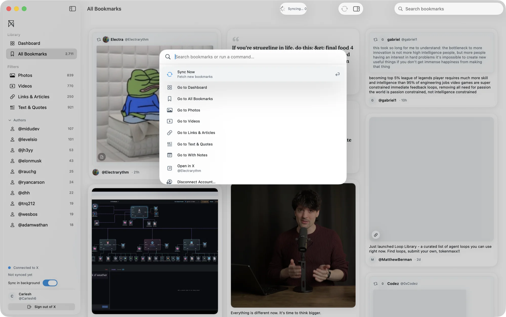
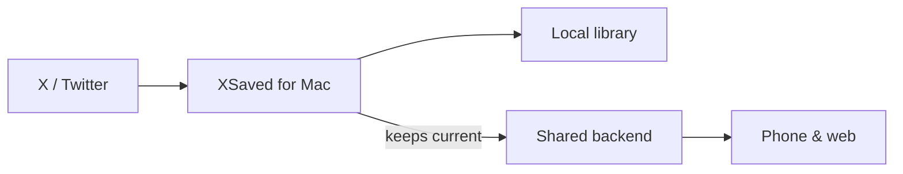

  

  # XSaved for Mac

  A native Mac app for browsing your X (Twitter) bookmarks as a real library — and the quiet engine that keeps the rest of your devices in sync.

  **TestFlight beta · in active development**

   

  

 

> This repository is a public overview of the Mac app — what it does, how it's designed, and a few of the problems worth writing about. The source code is private.
>
> It's part of a small family of XSaved apps: a [browser extension](https://github.com/AitorGallardo/xsaved-showcase), this Mac app, and an [iPhone app](https://github.com/AitorGallardo/xsaved-ios-showcase), sharing one design language and one backend.

## Overview

The desktop is where you actually work with what you've saved — searching it, organizing it, getting it back out. The native bookmarks page does none of that.

XSaved for Mac is two things at once:

- **A desktop library** — an adaptive grid of your bookmarks, full-text search, a command palette, sidebar filters, a detail inspector, and drag-and-drop into other apps.
- **The sync engine** — it keeps your library current in the background and quietly keeps your other devices up to date, so the phone and the web stay fresh without doing the heavy lifting themselves.

<table>
  <tr>
    <td width="50%"></td>
    <td width="50%"></td>
  </tr>
  <tr>
    <td width="50%"></td>
    <td width="50%"></td>
  </tr>
</table>

## Worth writing about

A few problems that took real work to get right.

### Being the sync engine for everything else

The Mac carries the work the other apps shouldn't have to: it keeps the shared library current and, when another device asks for fresh data, wakes up and catches up within seconds. Doing it here — on a machine that's plugged in and can run quietly in the background — keeps the phone fast and light, and keeps the whole system resilient to changes in the source platform.

### A desktop app that feels like a desktop app

It leans on native window chrome rather than reinventing it: a sidebar, a detail inspector, standard search, and a settings window. On top of that sit the things that make a Mac app feel right — a command palette to jump anywhere or run anything, undo with a quiet toast, dragging a bookmark straight into Finder, Notes, or Messages, and a menu-bar companion for syncing without opening the window.

### One design language, two platforms

The Mac shares its design system with the iPhone app and extends it for the desktop. The same rules apply — one source for color, type, spacing, and motion — so the apps feel like siblings, and each screen stays consistent as the app grows.

## How it fits together

The Mac reads your bookmarks, keeps a local copy, and feeds a shared backend the other apps read from. More detail — kept high-level on purpose — lives in [docs/ARCHITECTURE.md](docs/ARCHITECTURE.md).

## More

- [docs/PRODUCT.md](docs/PRODUCT.md) — what it is, who it's for, and the thinking behind it
- [docs/ARCHITECTURE.md](docs/ARCHITECTURE.md) — how the app is put together, at a high level
- [docs/ROADMAP.md](docs/ROADMAP.md) — what's shipped and what's next

---

  <a href="https://xsaved.com">xsaved.com</a> · <a href="https://github.com/AitorGallardo/xsaved-ios-showcase">iPhone app</a> · <a href="https://github.com/AitorGallardo/xsaved-showcase">browser extension</a>
   
  Documentation only — the product source is private.

