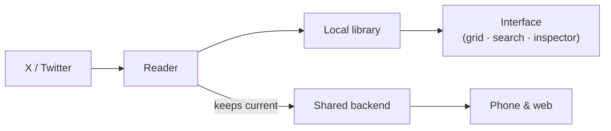

# Architecture

A high-level look at how the app is put together. It stays general by design — the goal is to explain the shape, not hand over the blueprint.

## The shape

The Mac reads your bookmarks, keeps a local copy for an instant start, and feeds a shared backend that the other apps read from. It's the only app in the family that does the collecting — everything else reads.

The pieces:

- **A reader** that brings your bookmarks in.
- **A local library** that's available immediately on launch and keeps a copy even if the original is later deleted.
- **The interface** — the grid, search, inspector, and the desktop touches around them — built natively.
- **A sync layer** that keeps the shared library current in the background and catches up on demand when another device asks.

## A few decisions worth noting

**The Mac carries the load on purpose.** Concentrating the demanding work on a machine that's plugged in and can run quietly in the background lets the phone stay a fast, simple reader — and keeps the whole system resilient to changes on the source platform.

**On-demand without constant polling.** Rather than hold a connection open or hammer the network, the app catches up quickly when there's actually something to do, which is light on the network and on battery.

**Native chrome, not reinvented.** The window uses the system's own building blocks — sidebar, inspector, search, settings — with a set of desktop interactions layered on top: a command palette, undo, drag-out, and a menu-bar companion.

## Honest notes

- Cross-device persistence is solid today and getting a more native treatment next.
- The on-demand sync is a deliberately simple, reliable approach; a true instant-push version is a later step.
